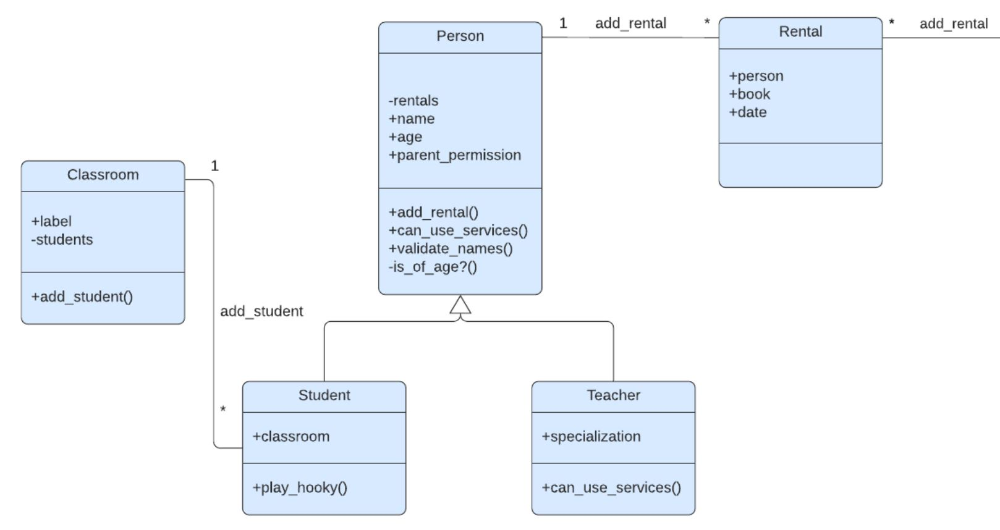
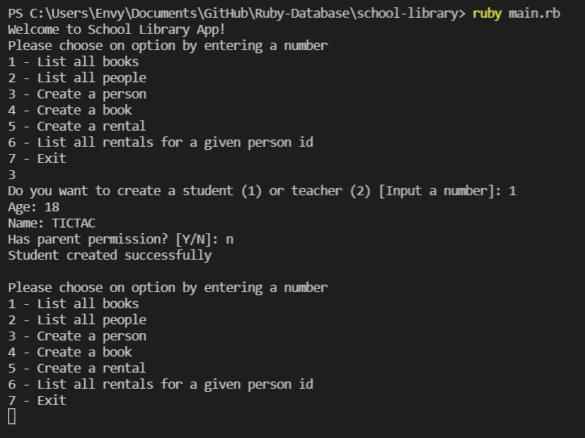
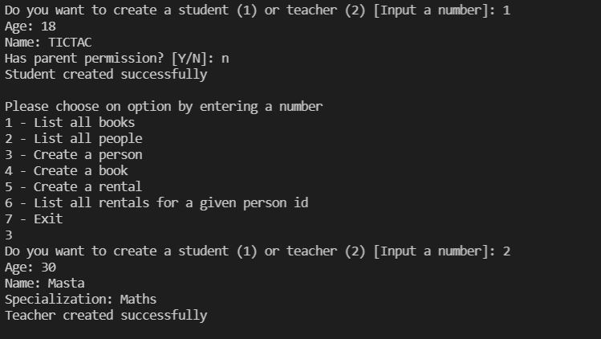
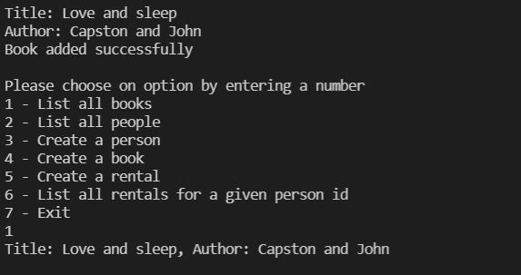
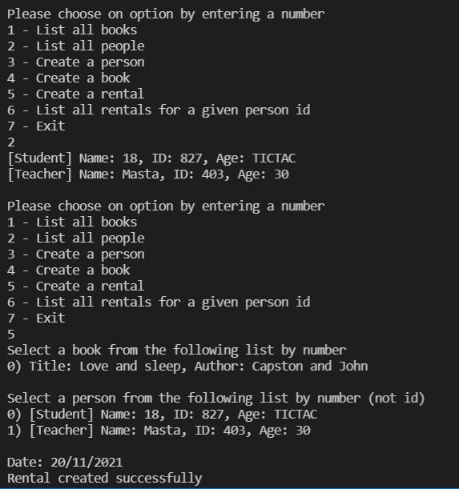

## School-library

Imagine that you are the librarian of OOP University, and you need a tool to record what books are in the library and who borrows them. This app that I Created will make your library the best organized one. 
This app allows you to:
Add new students or teachers.
Add new books.
Save records of who borrowed a given book and when.

## Built With
- Ruby
- OOP
- rubocop

## Author
👤 **Olipliche Mavoungou Paka**
- GitHub: [https://github.com/OLIPLICHE)
- LinkedIn: [LinkedIn](https://www.linkedin.com/in/olipliche/)

## 🤝 Contributing
Contributions, issues, and feature requests are welcome!

## Show your support
Give a ⭐️ if you like this project
## Acknowledgments
- Hat tip to anyone whose code was used
- Inspiration

## 📝 License
This project is [Microverse](https://www.microverse.org/) licensed.
